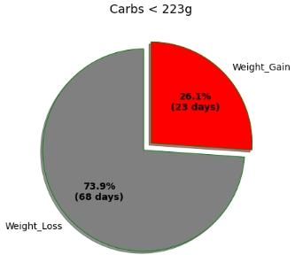
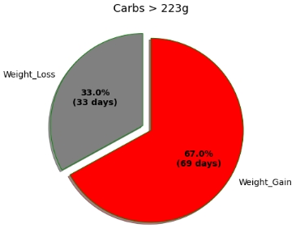
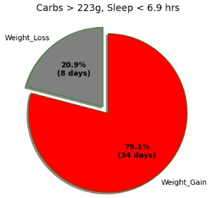
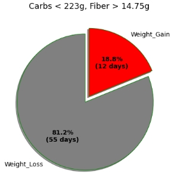

# Guess My Weight

## Overview
Health and Wellness is a $142 billion dollar industry encompassing health, fitness, nutrition, appearance, sleep and mindfulness. A major component of this industry is weight loss, which is related to both chronic physical disease and  mental health. This project contains a model to predict next day weight loss (i.e. whether the reading on the scale is less than the previous day's weigh-in). It's intended for use in calorie counting apps to recommend corrective action, focusing on small, achievable daily goals. This model used seven different algorithms that were trained on captured lifestyle data (my personal diet, exercise, and sleep data) and fine-tuned to consider precision and accuracy metrics. It determined that a Carbohydrate threshold, or Carb Number, was the biggest predictor of next day weight loss or gain. At under 223g (for this user) nearly 74 percent of the next day's weigh-ins showed a loss. This increased to nearly 82% when
acheiving a minimum fiber intake around 14.5 grams. Conversely, at over 223g, nearly 66 percent of
the next day weigh-ins showed a gain. This increased to 79 percent when less than 6.9 hrs of sleep were recorded. Based on these findings, small, daily metrics can impact weight loss/gain. These analytics can be used to prompt or guide users through out the day to encourage certain habits and/or course corrections. This feature should be developed further to test over a wider audience and integrate into a lifestyle app.
 

## Quick Links
Click here for the [deck](pdfs/presentation.pdf)

## Table of Contents TOC
[Google Colab Instruction](#google-colab-instructions) 
[Business Case](#business-case) 
[Data Understanding](#data-understanding) 
[Data Preparation](#data-preparation) 
[Modeling](#modeling) 
[Evaluation](#evaluation) 
[Key Findings](#key-findings) 
[Summary](#summary) 
[Github Repository](#github-repository) 

## Google Colab Instructions
To run this code in this notebook, you'll need a Kaggle log-in and web access to [Google Colab and link to this notebook](https://colab.research.google.com/github/bennettandrewm/guess_my_weight/blob/master/guess_my_weight_notebook-6-8.ipynb). Google Colab is a free, user-friendly platform to run software, specifically data models. Kaggle is a [website](https://www.kaggle.com/) popular with the data industry that hosts databases and runs data analytics competition. To access the [database](https://www.kaggle.com/datasets/andrewmbennett/guess-my-weight-4-25) for this model, you
will need to create a Kaggle account and follow the instructions to download your 'token' and 'key'. This
model will prompt you to have that information.
 [return to TOC](#table-of-contents-TOC)

## Business Case
According to a CDC study, the obesity prevalence rate in the US was 42 percent in 2020. The Health and
Wellness industry, valued at around $142 billion, has a plethora of systems, apps, and protocols to address
this, yet it's still a problem. On a human level, we all know that managing our weight is both critical to health
and happiness but also incredible challenging. The average person has dieted over 6 times in their life,
according to a survey by the Mayo Clinic. There's a demand among consumers as well as a basic human yearn to
feel in control of our health. Creating additional, more intuitive tools to manage weight loss is critically important. 

In this model, we focus on the impact of small, short term goals (daily diet, exercise, and sleep) on next-day weigh-ins. To simplify this task, we utilize binary prediction, either weight loss or weight gain, to determine if the sum of these daily habits predict this binary
outcome.
 [return to TOC](#table-of-contents-TOC)

## Data Understanding
The data source for this analysis is my personal health information. That data was download from my smart device to a local setting, where it was pre-processed, formatted, and uploaded to [Kaggle](https://www.kaggle.com/datasets/andrewmbennett/guess-my-weight-4-25) for public use. It can also be found in this github repository. Follow [instructions](#github-repository) below. 
 [return to TOC](#table-of-contents-TOC)

The data can be found in the following locations:

* [Kaggle](https://www.kaggle.com/datasets/andrewmbennett/guess-my-weight-4-25)
* [THis Repository](content/guess-my-weight-4-25/merge_health_4_25.csv)

Over the course of 6 months, I lost approximately 20 lbs. Tracking my calories and weight was a big part of it, as well data captured from my devices passively, such as workouts, heart rate, sleep, etc. The weigh-in data is here. 

## Data Preparation
The model aims to predict whether a loser lost weight. The wiegh-in data is used to establish whether the
user (me) gained or lost weight from the previous day's weigh-in. This was achieved through differencing, and the
data was verified for stationality to ensure there was no correlation with time (beyond the previous day). To
understand the data in terms of weight gain days, see the below graph.
 [return to TOC](#table-of-contents-TOC)

Prior to modeling, there were concerns regarding correlation. PCA and Correlations were studied and due to these concerns, the feature data we divided into segments based on a data heirarchy. A schematic can be seen
below.

This mitigates some of the correlation between say a macro category like Carbs (parents) and it's children categories (sugar, for instance).

## Modeling
In order to select the best model, we surveyed a variety of traditional algorithms and use different feature
segments (level 1, level 2, and level 3). KNN, Logistic Regression, Decision Tree, Naive Bayes, SVM, and
Neural Network models were utilized and their evaluation metrics scored in a table for comparison. Of all of the metrics, precision was
given the highest preference, second was accuracy. Because we want to predict weight loss, we have a
strong emphasis on getting True Positives correct. We want to recommend to users with confidence to lose
weight. Accuracy is secondary but still matters, because we are interested in True Negatives, namely,
predicting weight gain.
 [return to TOC](#table-of-contents-TOC)

Based on these results, a Decision Tree model was utilized.

## Evaluation
The Decision Tree from the modeling survey in the previous section scored 80% and 78% precision,
respectively. Upon inspection of the data, it was clear that feature_2, expressing the Total Carbohydrates
consumed, was the strongest indicator. To reflect this, the model was fine tuned, combining elements from
feature_2 and feature_3 segments. This tuning yielded key findings in the section shown below, while
sacrificing some Precision on the test data (75% from 80%). This was a difference of one prediction. The
confusion matrix for the model's test results are shown below.
 [return to TOC](#table-of-contents-TOC)

[return to TOC](#table-of-contents)

## Key Findings

#### Carbs

Carbs, for this user's lifestyle, was the strongest indicator in the model of potential weight loss. When under the carbohydrate threshold (223g), 74% of their weigh-ins the next day showed weight loss. Vice-Versa, when the user
was over the threshold (223g), 67% of the weigh-ins next day showed a gain.

#### Lack of Sleep

Lack of sleep may also contribute to weight gain. In instances when the user was over the carbohydrate
threshold, and slept less than 6.9hrs, almost 80% of the weigh-ins showed a gain. That's a 13% increase.

#### Fiber

Fiber may assist in weight loss. In instances when the user was under the carbohydrate
threshold, but consumed at least 14.75g of Fiber, the occurence of weight loss increased to nearly 82% of the weigh-ins showed a gain. That's an 8% increase.

 [return to TOC](#table-of-contents-TOC)

## Summary
This model shows that with tracking the right data we can identify strong indicators towards managing weight. Targeting weight loss days turned out to be an effective way to apply machine learning to health data.

### Next Steps:
#### Additional Data
We need to continue to refine the model to boost performance. Typically, over 1000 observations are needed to have confidence in a model. We only had 195 observations, nearly 30% of which had gaps in weight data. With more data we can optimize the success we already have.

#### Test UI Prompts
Recommendations for course correction are only as effective as how the message is delivered. For carb tracking, perhaps the user could monitor their carb intake through the day and receive a notification when intake is high. With Fiber, the user could be pinged at the end of the day if their fiber intake is low. When carb intake increases, the user could be reminded to get enough sleep.

#### Try Calorie Counting
Increase awareness around calorie counting. It's hard at first but then it becomes second nature. It's very helpful to track what one eats.
 [return to TOC](#table-of-contents-TOC)

## Github Repository

To execute this project, a github repository is utilized for public viewing and collaboration. The source file for the original data is not available.

You can see the following files stored in the github repository.

* *content*  - Folder containg process personal health data files
    * [merge_health_4_25.csv](content/guess-my-weight-4-25/merge_health_4_25.csv)

* *Images* - Folder containing the image files used in the Notebook, Presentation, and README file

* *PDFs* - Folder containing the pdf versions of the Slides, the Notebook, and Presentation

* *pre_kaggle* - Folder containing previous revisions of different files
            
* [README](README.md) the currently file you're reading with descriptions about the coding file

* [.gitignore](.gitignore) - git ignore file 

* [guess_my_weight_notebook](guess_my_weight_notebook-6-8.ipynb) - Notebook with Python analysis

 [return to TOC](#table-of-contents-TOC)
