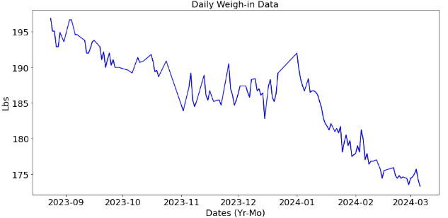
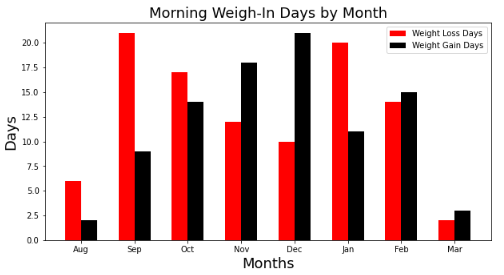
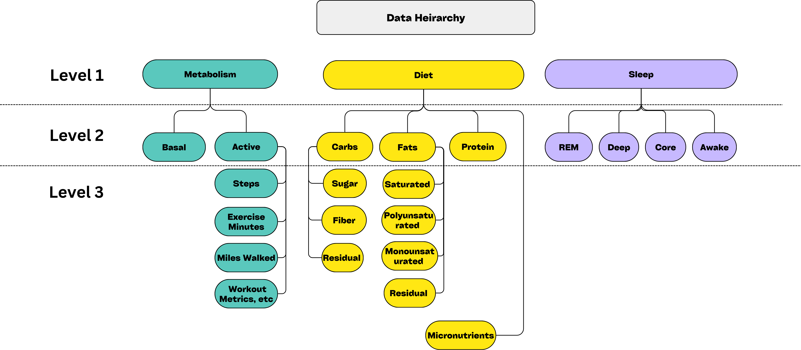
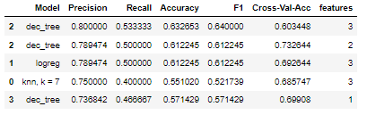
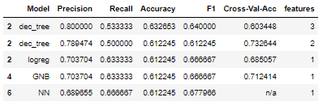
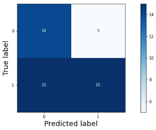
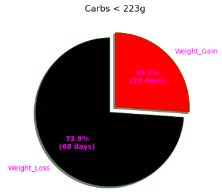
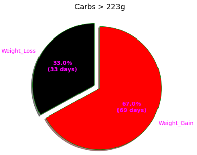
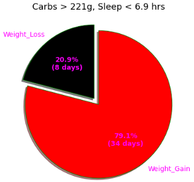
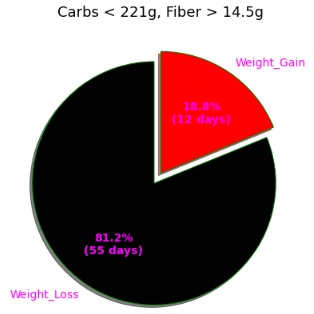

# GUESS MY WEIGHT 

## Table of Contents TOC
[Overview](#overview) 
[Google Colab Instructions](#instructions-for-google-colab) 
[Business Case](#business-case) 
[Data Understanding](#data-understanding) 
[Data Preparation](#data-preparation) 
[Modeling](#modeling) 
[Evaluation](#evaluation) 
[Github Repository and Resources](#github-repository-and-resources) 
[Google Colab](https://colab.research.google.com/github/bennettandrewm/guess_my_weight/blob/master/guess_my_weight_notebook.ipynb) 

## Overview
Health and Wellness is a $142 billion dollar industry designed to help people managed their weight. This model is intended as a feature to guide users tracking lifestyle data (diet, exercise, sleep) with recommendations to target weight loss.  A machine learning Decision Tree algorithm analyzed captured lifestyle data with emphasis on precision and accuracy metrics. The model determined a Carbohydrate threshold, or Carb Number, which corresponded to next day weight loss or gain. At under 221g (for this user) nearly 74 percent of the next days weigh-in showed a loss. This increased to nearly 82% when acheiving a minimum fiber intake around 14.5 grams as well. Conversely, at over 221g, nearly 66 percent of the weigh-ins showed a gain. This increased to 79 percent when less than 6.9hrs of sleep was recorded in addition to the carb threshold. Based on these findings, it's recommended that these analytics be used to prompt/guide users through out the day to course correct on encourage certain habits.  
[return to TOC](#table-of-contents-TOC)

## Instructions for Google Colab
To run this notebook, you'll need a Kaggle log-in and web access to Google Colab. Google Colab is a free, user-friendly platform to run software, specifically data models. Kaggle is a website popular with data industry that hosts databases and runs data analytics competition. To access the database for this model, you will need to create a Kaggle account and follow the instructions to download your 'token' and 'key'. This model will prompt you to have that information.   
[return to TOC](#table-of-contents-TOC)

## Business Case
According to a CDC study, the obesity prevalence rate in the US was 42 percent in 2020. The Health and Wellness industry, valued at around $142 billion, has a plethora of systems, apps, and protocols to address this, yet it's still a problem. On a human level, we all know that managing our weight is both critical to health and happiness but also incredible challenging. The average person has dieted over 6 times in their life, according to a survey by the Mayo Clinic. There's a demand among users as well as a basic human earn to feel in control of our health. Creating additional, more intuitive tools to manage weight loss is a vast importance.

In this model, we focus on a small short term goals to determine if daily diet, exercise, and sleep goals can impact your weigh-in the next day. To simplify this task, we'll utilize binary prediction, either weight loss or weight gain, to determine if the sum of these daily habits to determine how they predicted this binary outcome. 
[return to TOC](#table-of-contents-TOC)

## Data Understanding
The data source for this analysis is my personal health information. Over the course of 6 months, I lost approximately 20 lbs. Tracking my calories and weight was a big part of it, as well data captured from my devices (Iphone, Apple Watch). The dataset contains both the information that I logged (daily weigh-ins and food journaling) as well as workouts, heart rate, sleep, etc tracked passively. You can see the data here.

Prior to Kaggle upload, the data from the phone was condensed into daily sums. The totals (exercise, sleep, diet) from the day were used as the feature data for prediction  
[return to TOC](#table-of-contents-TOC)

## Data Preparation
The model aims to predict whether a loser lost weight. The wiegh-in data is used to establish whether the user gained or lost weight from the previous day's weigh-in. This was achieved through differencing, and the data was verified for stationality to ensure there was no correlation with time (beyond the previous day). To understand the data in terms of weight gain days, see the below graph.

 

Prior to modeling, there were concerns regarding correlation. PCA and Correlations were study. Due to these concerns, the feature data we divided into segments based on a data heirarchy. A schematic can be seen below.

 

[return to TOC](#table-of-contents-TOC)

## Modeling
In order to select the best model, we surveyed a variety of traditional algorithms and use different feature segments (level 1, level 2, and level 3). KNN, Logistic Regression, Decision Tree, Naive Bayes, SVM, and Neural Network models were scored in a table using evaluation metrics. Of all of the metrics, precision was given the highest preference, second was accuracy. Because we want to predict weight loss, we have a strong emphasis on getting True Positives corret! We want to recommend to users with confidence to lose weight. Accuracy is secondary but still matters, because we are interested in True Negatives, namely, predicting weight gain accurately as well.

 

 

Based on these results, a Decision Tree model was utilized. 
[return to TOC](#table-of-contents-TOC)

## Evaluation
The Decision Tree from the modeling survey in the previous section scored 80% and 78% precision, respectively. Upon inspection of the data, it was clear that feature_2, expressing the Total Carbohydrates consumed, was the strongest indicator. To reflect this, the model was fine tuned, combining elements from feature_2 and feature_3 segments. This tuning yielded key findings in the section shown below, while sacrificing some Precision on the test data (75% from 80%). This was a difference of one prediction. The confusion matrix for the model's test results are shown below. 

 

[return to TOC](#table-of-contents-TOC)

## Key Findings
From the model emerged three key findings:

#### Carbs
The strongest indicator in the model of potential weight loss. When under the carbohydrate threshold (223 g) the user experienced 74% of their weigh-ins the next day showed weight loss. Vice-Versa, when the user was over the threshold (223g), 67% of the weigh-ins next day showed a gain.

 
 

#### Lack of Sleep
Lack of sleep may contribute to weight gain. In instances when the user was over the carbohydrate threshold, and slept less than 6.9hrs, almost 80% of the weigh-ins showed a gain. That's a 12% increase.

 

#### Fiber
Having a minimum intake of Fiber could help with weight loss. In instances when the user was under the carbohydrate threshold, and consumed more than 15.75 grams of Fiber, almost 82% of their next day weigh-ins showed a loss. That's an 8% increase over just the carbs.

 

##  Summary
To aid in the struggle to lose weight, this model was able to analyze data and create 3 key finding that could be used to help people reach their goals. Through lifestyle analytics, a user can track their eating over the case of the day and receive notifications about how to course correct. The model utilized a database from apps and devices that the user is already using.  
[return to TOC](#table-of-contents-TOC)

## Github Repository and Resources
To execute this project, a github repository is utilized for public viewing and collaboration

You can see the following files stored in the github repository.

Images - Folder containing the image files used in the Notebook, Presentation, and README file

pre-kaggle - contains originally brainstorm notebook
- brainstorm.ipynb

.gitignore - git ignore file

README the currently file you're reading with descriptions about the coding file

guess_my_weight-6-8.ipynb - Notebook with Python analysis

[return to TOC](#table-of-contents-TOC)

