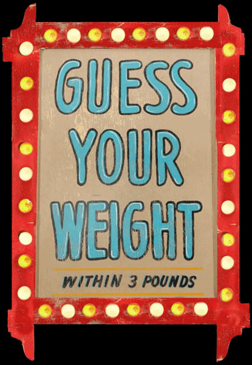

# GUESS MY WEIGHT 

## Table of Contents
## [Overview] (#overview)
## [Data Understanding] (#data-understanding)
## [Data Preparation] (#data-preparation)
## [Modeling] (#modeling)
## [Evaluation] (#evaluation)
## [Github Repository and Resources] (#github-repository-and-resources)

## Overview
[return to TOC](#table-of-contents)
Health and Wellness is a big business. Specifically, weight loss. We’re all trying because it’s very, very hard. I recently went on my own weight loss journey, losing about 50 lbs in roughly 18 months. Weighing myself every morning, I agonized over every tenth of a lb, recording it in an app on my phone. I realized that losing big chunks of weights starts with small, incremental progress on the scale. But I didn’t stop there. As a data nerd I thought, “let’s record every meal.” So I did that too. I wondered… given all this data I have, could I predict my weight? My watch and phone captures my exercise, sleep, eating, and so much more. There must be trends here. At a minimum, I should be able to predict whether my weight will go up or down from the previous day. So let’s do it.

## Data Understanding
[return to TOC](#table-of-contents)
I have much (and probably too much) of this data in my iphone and Apple Watch. It contains the weight information, workouts, heart rate, meals - broken down into subcategories (proteins, fats, etc). Most importantly is the weight. That will be the feature that I primarily use for classification.  

Because it’s my data, there’s more clarity about data entry methods. This is more subjective, than a controlled experiment with many participants. I know what data I was diligent about collecting so I should be able to scrub it appropriately. For instance, I didn’t record my fluids consistently - water, tea, coffee. Water consumption is a big part of this so I’ll have to be clear about the gaps in the data. 

## Data Preparation
[return to TOC](#table-of-contents)
The data is stored in an xml file on my phone. After downloading it into python notebook and digging a little, there are roughly 180 rows of weight entries (approximately 6 months) but it’s not clear how many gaps there are. All of the data is stored as an entry, with time stamps and usually some numeric form. Whether it’s heart rate, weight, caloric info, it’s one numeric entry with an associated units. We’re primarily dealing with ints and floats, all numeric, and we’ll be using daily totals/averages. Because we only have one weigh-in per day, we’re only going to use daily values of other data. So… we know we have approximately 100-180 rows. I can’t say at the moment how many columns, because this will be based on what happens in pre-processing. Which brings me to../.

There are two major challenges with the pre-processing. The first deals with the privacy of my personal health data. How do I balance reproducibility requirements with privacy concerns? I need to make the dataset publicly available, including all of my pre-processing steps, but I also want to make sure no one can link it back to me, Andrew Q. Bennett (my real middle name doesn’t start with Q… gotcha!!!!). And the initial dataset is large, maybe 40 MB. The approach we’ll use is to perform some pre-processing locally, and then upload to the kaggle site when it’s ready for public consumption. In my jupyter notebook, I will comment out some of this code so that we can see the work, but it won’t affect the code when we press “run”.

The second is dealing with correlation efforts. For instance, we know that all data related to working out is going to be correlated with eachother. The steps, average heart rate, workout calories, etc will all be correlated to whether I went for a jog that day. Making decisions about which data to use will be a challenge, even with some baseline domain knowledge. There is a treasure trove that may have nothing (or very little) to do with weight loss, like Vitamin A intake. PCA Analysis will be critical without losing some data. I know about health…but I’m no expert. Maybe Vitamin A intake can help/hurt weight loss.

The many visualization efforts will come from making sure the weight data is presented cleanly. A nice, regression line showing weight trends over different periods will be very helpful.

## Modeling
[return to TOC](#table-of-contents)
Some of the fun here is the variety of methods that could be used. We could predict the actual weight, whether or not my weight will go up, or what the actual differential is going to be. We could use linear regression to predict weight, logistic regression (or any classifier) to determine whether or not I’ll lose weight. The target variable is the actual weight, but we will also create a binomial weight loss classification to determine if I lost weight or not. They’ll also be a time series component to this… for instance, the food and exercise you’ve gotten on the previous 2 days may matter more than just the food you eat that day.

## Evaluation
[return to TOC](#table-of-contents)
The metrics used for evaluation will be accuracy, with consideration of correlation and PCA effects. The human body is a mystery, but it could be as simple as calories in vs exercise. Perhaps we only need a handful of variables to be reasonably accurate. The baseline metric for the weight loss classification will be random predictions representing the percentage of the days that weight loss occurred. The baseline metric for weight prediction would be the accuracy of predicting the average weight change. A minimum viable product would be an improvement in accuracy over these baseline accuracy metrics.

## Github Repository and Resources
[return to TOC](#table-of-contents)

